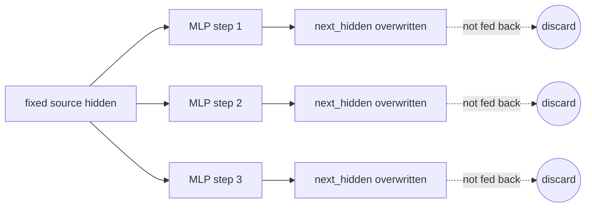
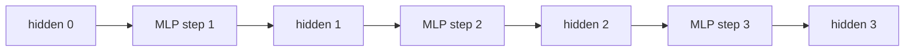

# MLP Replay vs State-Chain Report

## Executive Summary

This experiment isolates the power/clock behavior behind the Llama stack
microbenchmarks using the smallest still-faithful MLP workload:

`gate + up -> silu_and_mul -> down`, optionally followed by
`fused_add_rmsnorm`.

The key result is that adding the same norm boundary has almost no effect in
`fixed_replay`, but strongly changes the operating point in `state_chain`.
In `state_chain`, adding `fused_add_rmsnorm` reduces GEMM-only throughput by
`7.76%`, raises average power by `81.41 W`, and lowers GPU clock by
`114.54 MHz`.

Because `GEMM TFLOPs/s` is computed only from CUDA event time around the
gate/up/down GEMM kernels, the drop is not caused by including norm or
activation time in the denominator. It shows that the surrounding GEMMs run
slower under the state-carrying norm/residual cadence.

## Source

- Snapshot report:
  `results/gemm_replay_vs_chain/latest/a100_40g_sxm/BENCHMARK.md`
- Source run:
  `results/gemm_replay_vs_chain/20260427T100209Z/BENCHMARK.md`
- Benchmark script:
  `scripts/benchmarks/run_gemm_replay_vs_chain_microbench.py`

## Setup

| Field | Value |
| --- | --- |
| GPU | A100 40G SXM, physical GPU 3 |
| Shape | Llama-13B prefill |
| Prompt length | 8192 |
| Hidden size | 5120 |
| Intermediate size | 13824 |
| Dtype | bfloat16 |
| Workload | `gate + up -> silu_and_mul -> down` |
| Steps per run | 40 |
| Variants | without norm, with `fused_add_rmsnorm` |
| Modes | `fixed_replay`, `state_chain` |

## Metric Definition

The throughput column is strict GEMM-only throughput:

`GEMM TFLOPs/s = gate/up/down GEMM FLOPs / CUDA event time around gate/up/down torch.mm kernels`

Excluded from the denominator:

- `silu_and_mul`
- activation copy / concat path
- `fused_add_rmsnorm`
- Python loop and monitor overhead

`Total Iter Time` still includes the full workload and is shown separately.

## Code Semantics

Both modes execute the same MLP body:

```text
hidden
  -> gate GEMM: hidden x gate_weight -> gate_out
  -> up GEMM:   hidden x up_weight   -> up_out
  -> silu_and_mul(gate_out, up_out)   -> act_out
  -> down GEMM: act_out x down_weight -> next_hidden
  -> optional fused_add_rmsnorm(next_hidden, residual, norm_weight)
```

The difference is what tensor is used as the next step's `hidden`.

In code, the relevant buffers are:

```text
source       fixed replay input, initialized once and then reused
current      state-chain input buffer
next_hidden  output buffer for the next MLP result
residual     residual input used by fused_add_rmsnorm
```

The important point is that both modes can run the same optional
`fused_add_rmsnorm` kernel, but only `state_chain` feeds the normalized output
into the following GEMMs.

### Fixed Replay

In `fixed_replay`, every step reads the same immutable `source` tensor. The
MLP output is written to `next_hidden`, but it is discarded for purposes of the
next step.

The benchmark loop is effectively:

```python
for _ in range(steps_per_run):
    run_mlp_once(source, next_hidden)
```

Conceptually:

```text
step 1: source ──MLP──> next_hidden  discarded
step 2: source ──MLP──> next_hidden  discarded
step 3: source ──MLP──> next_hidden  discarded
...
step N: source ──MLP──> next_hidden  discarded
```

With the optional norm enabled:

```text
                 gate/up/down GEMMs        fused_add_rmsnorm
step i: source ───────────────────> tmp_i ─────────────────> norm_i
        ^                                                     |
        |                                                     v
        +------------------- next step still reads source   discarded
```

Buffer lifecycle:

```text
source       read read read read ...
next_hidden  write/overwrite write/overwrite write/overwrite ...
```

So `fixed_replay` is not a stack. It is a replay harness: each step has the
same mathematical input distribution at the GEMM boundary, and the previous
step's result cannot affect the next step's GEMM input.

Mermaid version:



This mode answers: what happens if we repeatedly replay the same MLP input and
optionally append a norm boundary after each replay?

It is useful as a control because it has the same GEMM shapes and same optional
norm, but not the stack-like dataflow.

### State Chain

In `state_chain`, the MLP output becomes the next hidden input. The benchmark
keeps two hidden buffers and swaps them after each step:

```python
for _ in range(steps_per_run):
    run_mlp_once(current, next_hidden)
    current, next_hidden = next_hidden, current
```

Conceptually:

```text
step 1: hidden_0 ──MLP──> hidden_1
step 2: hidden_1 ──MLP──> hidden_2
step 3: hidden_2 ──MLP──> hidden_3
...
step N: hidden_N-1 ──MLP──> hidden_N
```

With the optional norm enabled:

```text
          gate/up/down GEMMs        fused_add_rmsnorm
hidden_i ───────────────────> tmp ─────────────────> hidden_i+1
   ^                                                   |
   |                                                   v
   +--------------------- next step GEMMs read hidden_i+1
```

Buffer lifecycle:

```text
step 1: current=A  next_hidden=B  -> write B  -> swap -> current=B
step 2: current=B  next_hidden=A  -> write A  -> swap -> current=A
step 3: current=A  next_hidden=B  -> write B  -> swap -> current=B
...
```

This is the minimal stack-like behavior. The result of the previous MLP,
including the effect of the norm/residual boundary when enabled, is exactly
what the next step's large GEMMs consume.

Mermaid version:



This mode answers: what happens when MLP outputs form a continuous
stack-like chain and the optional norm boundary sits between consecutive
large-GEMM steps?

The result is also carried across outer benchmark repeats, so `steps=40` is
not forty isolated one-step replays. It is a contiguous chain whose current
hidden state persists.

### Side-by-Side Mental Model

```text
fixed_replay:

source ──MLP(+norm?)──> out_1   discarded
source ──MLP(+norm?)──> out_2   discarded
source ──MLP(+norm?)──> out_3   discarded

state_chain:

hidden_0 ──MLP(+norm?)──> hidden_1 ──MLP(+norm?)──> hidden_2 ──MLP(+norm?)──> hidden_3
```

The first mode measures repeated execution of a component under a fixed input.
The second mode measures a component chain where each boundary can change what
the next large GEMM sees.

### Why This Distinction Matters

The two modes keep the same tensor shapes, weights, dtype, and optional norm
kernel. What changes is dataflow:

| Property | `fixed_replay` | `state_chain` |
| --- | --- | --- |
| Input to step `i` | Always the same `source` | Output of step `i - 1` |
| Output use | Overwritten/discarded | Becomes next input |
| Stack-like cadence | No | Yes |
| Tests norm self-cost? | Mostly yes | No, also tests operating-point feedback |
| Expected analogy | Repeated single block with fixed input | Multi-layer stack |

This distinction is the reason the final result is informative. If norm were
only adding local kernel self-time, the two modes would react similarly. They
do not: fixed replay barely moves, while state chain loses clock and GEMM-only
throughput.

## Results

| Mode | Norm | GEMM TFLOPs/s | GEMM Time / Iter (ms) | Total Iter Time (ms) | Avg Power (W) | Avg GPU Clock (MHz) |
| --- | --- | ---: | ---: | ---: | ---: | ---: |
| `fixed_replay` | no | 268.38 | 518.502 | 578.158 | 400.97 | 1289.11 |
| `fixed_replay` | yes | 268.78 | 517.738 | 586.894 | 392.11 | 1290.00 |
| `state_chain` | no | 292.98 | 474.964 | 532.024 | 316.99 | 1410.00 |
| `state_chain` | yes | 270.26 | 514.901 | 585.306 | 398.39 | 1295.46 |

## Key Deltas

| Comparison | GEMM Delta | Power Delta | Clock Delta |
| --- | ---: | ---: | ---: |
| fixed replay, add norm | +0.15% | -8.86 W | +0.89 MHz |
| state chain, add norm | -7.76% | +81.41 W | -114.54 MHz |
| state chain vs fixed replay, without norm | +9.17% | -83.98 W | +120.89 MHz |
| state chain vs fixed replay, with norm | +0.55% | +6.28 W | +5.46 MHz |

## Interpretation

The result separates two ideas that were previously easy to conflate:

1. Norm kernel self-time is not the main explanation.
2. The norm/residual boundary changes the frequency and power state seen by
   subsequent GEMM kernels in a long state-carrying chain.

In `fixed_replay`, adding norm does not move GEMM throughput or clock. In
`state_chain`, the same norm boundary removes the high-clock / low-power state
and brings the run close to fixed-replay behavior.

The cleanest explanation is therefore a workload-state effect:

- Without the norm boundary, the state-carrying MLP chain reaches a fast GEMM
  operating point: `292.98 TFLOPs/s`, `1410 MHz`, `316.99 W`.
- With the norm boundary, the same state-carrying chain enters a higher-power,
  lower-clock operating point: `270.26 TFLOPs/s`, `1295.46 MHz`, `398.39 W`.
- The surrounding GEMM kernels slow down even though norm and activation time
  are excluded from the GEMM throughput denominator.

## Why This Matters

This minimal MLP experiment reproduces the core behavior observed in deeper
Llama stack experiments without needing full attention, final norm, or lm_head.
It supports the current hypothesis:

The critical trigger is not simply that norm is expensive. The trigger is the
interaction between repeated residual/norm boundaries and a long contiguous,
state-carrying stream of large GEMM-like work.

## Caveats

- This snapshot intentionally uses `steps=40` for presentation. Earlier sweeps
  showed the qualitative pattern is not uniquely caused by the number 40.
- The result is an operating-point observation on A100 40G SXM. It should be
  rechecked on other GPU SKUs before generalizing.
- `silu_and_mul` is part of this focused workload because it is the real gated
  MLP path, but separate no-silu experiments showed silu is not strictly
  required for the broader phenomenon.

## One-Sentence Takeaway

In a state-carrying Llama MLP chain, inserting `fused_add_rmsnorm` makes the
following GEMMs run at lower clock and lower GEMM-only throughput; replaying the
same fixed input does not show this behavior.
