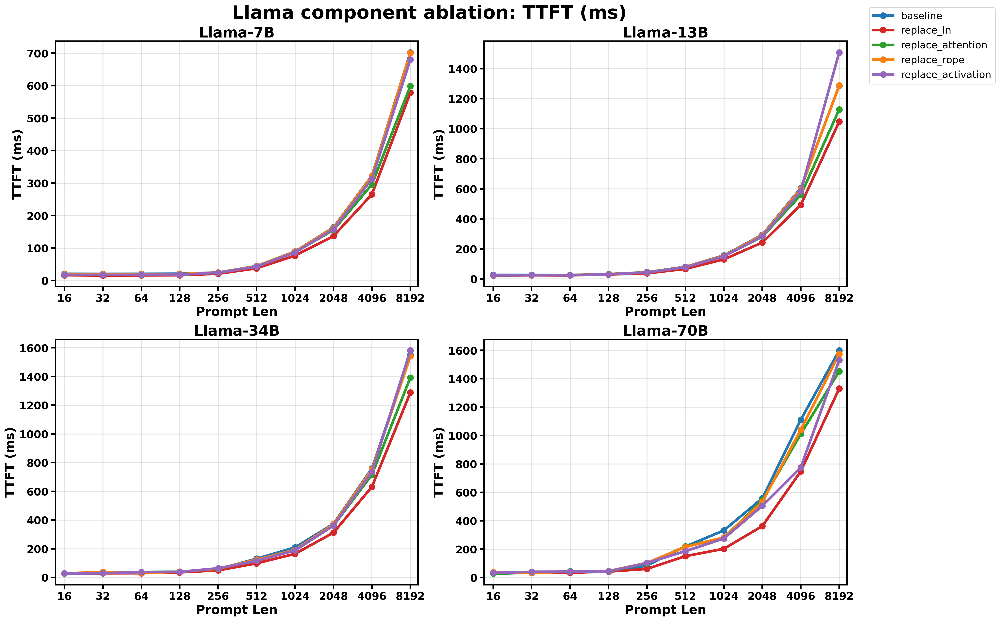
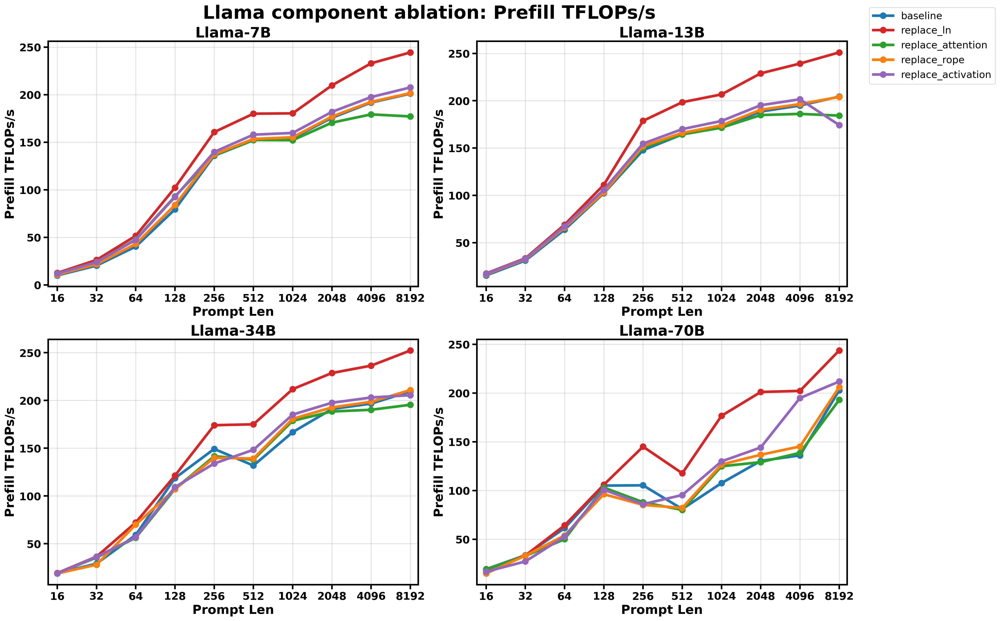
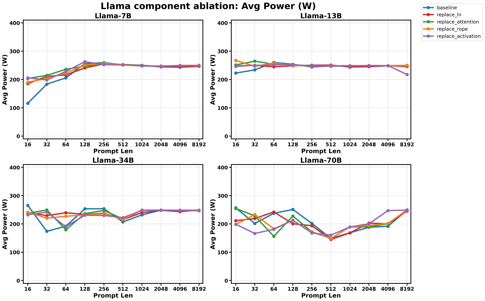
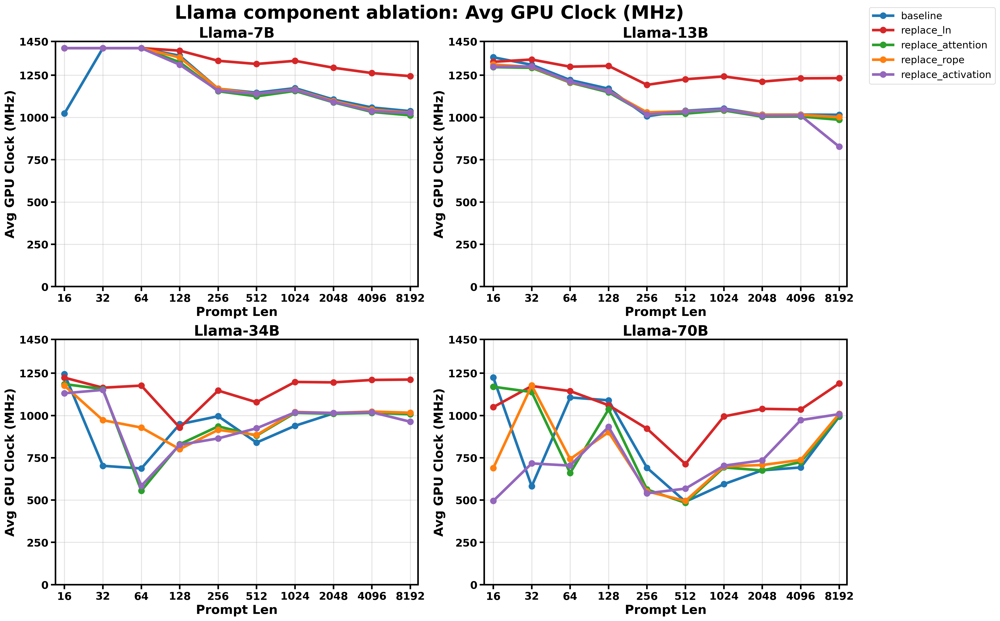

# Llama Component Ablation Benchmark

Generated at `2026-04-24T10:04:02.855593Z`.

## Summary

- Standard matrix: `7B/13B/34B/70B` x `16/32/64/128/256/512/1024/2048/4096/8192` x `baseline/replace_ln/replace_attention/replace_rope/replace_activation`
- Result directory: `results/llama_component_ablation_prefill/latest/a100_40g_pcie`
- Summary CSV: `results/llama_component_ablation_prefill/latest/a100_40g_pcie/summary.csv`
- Metadata: `results/llama_component_ablation_prefill/latest/a100_40g_pcie/metadata.json`
- Plots directory: `results/llama_component_ablation_prefill/latest/a100_40g_pcie/plots`
- These variants are component ablations for performance study, not numerically equivalent model variants.
- Prompt lengths outside the standard matrix are excluded from the summary tables and plots in this report.

## Environment

- Python: `3.13.13`
- Torch: `2.11.0+cu130`
- CUDA available: `True`
- CUDA device: `NVIDIA A100-PCIE-40GB`
- Warmup / repeat / monitor interval: `5` / `10` / `0.01`

## Plots

### TTFT

### Prefill TFLOPs/s

### Avg Power

### Avg GPU Clock

## Baseline vs replace_ln

| Model | Prompt Len | baseline TTFT (ms) | replace_ln TTFT (ms) | delta TTFT | baseline TFLOPs/s | replace_ln TFLOPs/s | delta TFLOPs/s | baseline Avg Power (W) | replace_ln Avg Power (W) | delta Power | baseline Avg GPU Clock (MHz) | replace_ln Avg GPU Clock (MHz) | delta Clock |
| --- | ---: | ---: | ---: | ---: | ---: | ---: | ---: | ---: | ---: | ---: | ---: | ---: | ---: |
| 7B | 16 | 20.62 | 16.43 | -20.32% | 10.06 | 12.62 | +25.51% | 115.91 | 185.31 | +59.88% | 1023.00 | 1410.00 | +37.83% |
| 7B | 32 | 20.38 | 15.78 | -22.57% | 20.36 | 26.30 | +29.16% | 183.50 | 211.00 | +14.98% | 1410.00 | 1410.00 | +0.00% |
| 7B | 64 | 20.58 | 16.07 | -21.93% | 40.38 | 51.72 | +28.10% | 205.64 | 216.00 | +5.04% | 1410.00 | 1410.00 | +0.00% |
| 7B | 128 | 20.95 | 16.28 | -22.30% | 79.54 | 102.36 | +28.70% | 255.81 | 240.78 | -5.88% | 1365.00 | 1395.00 | +2.20% |
| 7B | 256 | 24.65 | 20.84 | -15.45% | 135.90 | 160.72 | +18.27% | 259.50 | 254.67 | -1.86% | 1170.00 | 1335.00 | +14.10% |
| 7B | 512 | 44.47 | 37.59 | -15.48% | 152.21 | 180.09 | +18.32% | 251.92 | 252.92 | +0.40% | 1146.48 | 1316.35 | +14.82% |
| 7B | 1024 | 89.45 | 76.55 | -14.42% | 154.42 | 180.43 | +16.85% | 249.19 | 250.11 | +0.37% | 1173.41 | 1334.80 | +13.75% |
| 7B | 2048 | 163.45 | 136.89 | -16.25% | 175.74 | 209.84 | +19.41% | 246.92 | 244.44 | -1.00% | 1105.90 | 1293.89 | +17.00% |
| 7B | 4096 | 322.45 | 265.36 | -17.70% | 191.81 | 233.07 | +21.51% | 248.45 | 243.45 | -2.01% | 1058.94 | 1262.47 | +19.22% |
| 7B | 8192 | 702.32 | 577.80 | -17.73% | 201.17 | 244.52 | +21.55% | 248.41 | 246.61 | -0.72% | 1037.26 | 1244.37 | +19.97% |
| 13B | 16 | 26.23 | 23.12 | -11.84% | 15.49 | 17.57 | +13.44% | 222.63 | 246.58 | +10.76% | 1355.77 | 1329.13 | -1.96% |
| 13B | 32 | 26.09 | 24.22 | -7.17% | 31.15 | 33.56 | +7.72% | 233.94 | 250.17 | +6.94% | 1311.35 | 1342.50 | +2.38% |
| 13B | 64 | 25.51 | 23.56 | -7.63% | 63.80 | 69.07 | +8.26% | 260.04 | 244.81 | -5.86% | 1221.35 | 1300.00 | +6.44% |
| 13B | 128 | 31.86 | 29.34 | -7.93% | 102.36 | 111.17 | +8.61% | 253.79 | 248.51 | -2.08% | 1170.00 | 1305.00 | +11.54% |
| 13B | 256 | 44.33 | 36.64 | -17.33% | 147.76 | 178.74 | +20.97% | 244.29 | 250.40 | +2.50% | 1007.05 | 1192.70 | +18.44% |
| 13B | 512 | 80.32 | 66.55 | -17.14% | 164.44 | 198.46 | +20.69% | 247.44 | 250.92 | +1.41% | 1039.56 | 1225.91 | +17.93% |
| 13B | 1024 | 156.10 | 129.88 | -16.80% | 171.97 | 206.69 | +20.19% | 248.24 | 244.06 | -1.68% | 1052.73 | 1242.54 | +18.03% |
| 13B | 2048 | 293.79 | 242.01 | -17.63% | 188.59 | 228.94 | +21.40% | 249.30 | 245.21 | -1.64% | 1016.47 | 1211.91 | +19.23% |
| 13B | 4096 | 603.73 | 491.81 | -18.54% | 194.92 | 239.28 | +22.76% | 248.90 | 248.42 | -0.20% | 1016.81 | 1231.18 | +21.08% |
| 13B | 8192 | 1286.02 | 1046.98 | -18.59% | 204.39 | 251.06 | +22.83% | 248.95 | 246.03 | -1.17% | 1015.78 | 1232.45 | +21.33% |
| 34B | 16 | 27.79 | 27.57 | -0.79% | 19.13 | 19.29 | +0.80% | 265.31 | 241.09 | -9.13% | 1245.00 | 1223.57 | -1.72% |
| 34B | 32 | 36.47 | 29.13 | -20.12% | 29.17 | 36.52 | +25.19% | 173.96 | 229.32 | +31.82% | 702.50 | 1164.31 | +65.74% |
| 34B | 64 | 35.94 | 29.47 | -18.01% | 59.25 | 72.26 | +21.96% | 192.07 | 239.62 | +24.76% | 686.67 | 1176.72 | +71.37% |
| 34B | 128 | 35.93 | 35.13 | -2.22% | 118.70 | 121.39 | +2.27% | 253.43 | 233.41 | -7.90% | 948.75 | 928.29 | -2.16% |
| 34B | 256 | 57.32 | 49.14 | -14.27% | 149.26 | 174.12 | +16.65% | 253.77 | 238.03 | -6.20% | 995.53 | 1147.35 | +15.25% |
| 34B | 512 | 130.54 | 98.35 | -24.66% | 131.87 | 175.04 | +32.73% | 207.28 | 215.62 | +4.02% | 840.00 | 1078.30 | +28.37% |
| 34B | 1024 | 208.86 | 164.44 | -21.27% | 166.82 | 211.87 | +27.01% | 231.88 | 239.85 | +3.44% | 939.15 | 1198.33 | +27.60% |
| 34B | 2048 | 373.47 | 311.84 | -16.50% | 191.00 | 228.74 | +19.76% | 248.76 | 248.20 | -0.23% | 1012.48 | 1195.85 | +18.11% |
| 34B | 4096 | 758.84 | 631.24 | -16.81% | 196.69 | 236.45 | +20.21% | 248.52 | 243.43 | -2.05% | 1018.25 | 1210.23 | +18.85% |
| 34B | 8192 | 1550.75 | 1287.65 | -16.97% | 209.51 | 252.32 | +20.43% | 248.59 | 249.05 | +0.19% | 1015.23 | 1212.38 | +19.42% |
| 70B | 16 | 28.27 | 28.89 | +2.20% | 19.38 | 18.96 | -2.15% | 256.72 | 211.66 | -17.55% | 1225.18 | 1049.48 | -14.34% |
| 70B | 32 | 32.55 | 32.75 | +0.64% | 33.67 | 33.46 | -0.64% | 201.70 | 219.11 | +8.63% | 581.25 | 1174.09 | +101.99% |
| 70B | 64 | 35.66 | 34.09 | -4.40% | 61.50 | 64.33 | +4.61% | 237.50 | 242.40 | +2.06% | 1106.57 | 1144.41 | +3.42% |
| 70B | 128 | 41.76 | 41.41 | -0.83% | 105.17 | 106.05 | +0.84% | 251.08 | 200.83 | -20.01% | 1089.88 | 1060.61 | -2.69% |
| 70B | 256 | 83.52 | 60.68 | -27.35% | 105.42 | 145.10 | +37.64% | 201.84 | 193.56 | -4.10% | 690.73 | 922.25 | +33.52% |
| 70B | 512 | 218.14 | 150.26 | -31.12% | 81.12 | 117.76 | +45.18% | 148.97 | 145.24 | -2.50% | 490.37 | 713.01 | +45.40% |
| 70B | 1024 | 331.69 | 202.19 | -39.04% | 107.73 | 176.74 | +64.05% | 168.75 | 168.46 | -0.17% | 594.11 | 994.60 | +67.41% |
| 70B | 2048 | 558.15 | 362.08 | -35.13% | 130.51 | 201.18 | +54.15% | 188.22 | 202.94 | +7.82% | 676.04 | 1039.38 | +53.75% |
| 70B | 4096 | 1110.51 | 747.27 | -32.71% | 136.14 | 202.31 | +48.61% | 191.80 | 200.44 | +4.51% | 692.75 | 1035.57 | +49.49% |
| 70B | 8192 | 1598.82 | 1330.61 | -16.78% | 202.87 | 243.77 | +20.16% | 248.93 | 245.65 | -1.32% | 993.54 | 1189.22 | +19.69% |

## Baseline vs replace_attention

| Model | Prompt Len | baseline TTFT (ms) | replace_attention TTFT (ms) | delta TTFT | baseline TFLOPs/s | replace_attention TFLOPs/s | delta TFLOPs/s | baseline Avg Power (W) | replace_attention Avg Power (W) | delta Power | baseline Avg GPU Clock (MHz) | replace_attention Avg GPU Clock (MHz) | delta Clock |
| --- | ---: | ---: | ---: | ---: | ---: | ---: | ---: | ---: | ---: | ---: | ---: | ---: | ---: |
| 7B | 16 | 20.62 | 17.15 | -16.82% | 10.06 | 12.08 | +20.15% | 115.91 | 203.51 | +75.58% | 1023.00 | 1410.00 | +37.83% |
| 7B | 32 | 20.38 | 17.21 | -15.54% | 20.36 | 24.08 | +18.25% | 183.50 | 214.52 | +16.90% | 1410.00 | 1410.00 | +0.00% |
| 7B | 64 | 20.58 | 17.31 | -15.89% | 40.38 | 47.88 | +18.58% | 205.64 | 235.86 | +14.70% | 1410.00 | 1410.00 | +0.00% |
| 7B | 128 | 20.95 | 17.81 | -14.98% | 79.54 | 93.07 | +17.02% | 255.81 | 247.21 | -3.36% | 1365.00 | 1326.67 | -2.81% |
| 7B | 256 | 24.65 | 24.26 | -1.60% | 135.90 | 136.68 | +0.58% | 259.50 | 253.59 | -2.28% | 1170.00 | 1155.00 | -1.28% |
| 7B | 512 | 44.47 | 43.50 | -2.17% | 152.21 | 152.43 | +0.15% | 251.92 | 251.91 | -0.00% | 1146.48 | 1125.00 | -1.87% |
| 7B | 1024 | 89.45 | 87.15 | -2.58% | 154.42 | 152.19 | -1.44% | 249.19 | 249.75 | +0.23% | 1173.41 | 1156.92 | -1.41% |
| 7B | 2048 | 163.45 | 155.44 | -4.90% | 175.74 | 170.65 | -2.89% | 246.92 | 246.71 | -0.09% | 1105.90 | 1089.12 | -1.52% |
| 7B | 4096 | 322.45 | 295.79 | -8.27% | 191.81 | 179.35 | -6.49% | 248.45 | 249.75 | +0.52% | 1058.94 | 1032.68 | -2.48% |
| 7B | 8192 | 702.32 | 598.79 | -14.74% | 201.17 | 177.20 | -11.92% | 248.41 | 248.89 | +0.19% | 1037.26 | 1012.47 | -2.39% |
| 13B | 16 | 26.23 | 23.74 | -9.50% | 15.49 | 17.10 | +10.43% | 222.63 | 251.34 | +12.90% | 1355.77 | 1297.50 | -4.30% |
| 13B | 32 | 26.09 | 24.93 | -4.46% | 31.15 | 32.57 | +4.56% | 233.94 | 264.72 | +13.16% | 1311.35 | 1293.60 | -1.35% |
| 13B | 64 | 25.51 | 24.54 | -3.77% | 63.80 | 66.17 | +3.71% | 260.04 | 253.64 | -2.46% | 1221.35 | 1206.00 | -1.26% |
| 13B | 128 | 31.86 | 31.37 | -1.55% | 102.36 | 103.54 | +1.16% | 253.79 | 251.98 | -0.71% | 1170.00 | 1148.71 | -1.82% |
| 13B | 256 | 44.33 | 43.16 | -2.64% | 147.76 | 150.52 | +1.87% | 244.29 | 248.43 | +1.70% | 1007.05 | 1018.26 | +1.11% |
| 13B | 512 | 80.32 | 79.04 | -1.59% | 164.44 | 164.38 | -0.03% | 247.44 | 246.60 | -0.34% | 1039.56 | 1022.69 | -1.62% |
| 13B | 1024 | 156.10 | 151.49 | -2.95% | 171.97 | 171.53 | -0.25% | 248.24 | 248.50 | +0.10% | 1052.73 | 1041.54 | -1.06% |
| 13B | 2048 | 293.79 | 281.13 | -4.31% | 188.59 | 184.86 | -1.98% | 249.30 | 249.37 | +0.03% | 1016.47 | 1004.51 | -1.18% |
| 13B | 4096 | 603.73 | 558.42 | -7.51% | 194.92 | 186.13 | -4.51% | 248.90 | 249.06 | +0.06% | 1016.81 | 1005.52 | -1.11% |
| 13B | 8192 | 1286.02 | 1128.04 | -12.28% | 204.39 | 184.28 | -9.84% | 248.95 | 249.78 | +0.33% | 1015.78 | 986.17 | -2.92% |
| 34B | 16 | 27.79 | 28.05 | +0.94% | 19.13 | 18.95 | -0.97% | 265.31 | 237.59 | -10.45% | 1245.00 | 1185.54 | -4.78% |
| 34B | 32 | 36.47 | 29.86 | -18.12% | 29.17 | 35.60 | +22.04% | 173.96 | 249.28 | +43.30% | 702.50 | 1156.00 | +64.56% |
| 34B | 64 | 35.94 | 37.76 | +5.06% | 59.25 | 56.31 | -4.96% | 192.07 | 179.57 | -6.51% | 686.67 | 555.00 | -19.17% |
| 34B | 128 | 35.93 | 39.60 | +10.21% | 118.70 | 107.37 | -9.54% | 253.43 | 236.24 | -6.79% | 948.75 | 830.00 | -12.52% |
| 34B | 256 | 57.32 | 60.03 | +4.74% | 149.26 | 141.66 | -5.10% | 253.77 | 247.91 | -2.31% | 995.53 | 935.85 | -5.99% |
| 34B | 512 | 130.54 | 123.23 | -5.60% | 131.87 | 138.02 | +4.67% | 207.28 | 217.68 | +5.02% | 840.00 | 880.66 | +4.84% |
| 34B | 1024 | 208.86 | 190.35 | -8.86% | 166.82 | 178.70 | +7.12% | 231.88 | 248.96 | +7.37% | 939.15 | 1015.51 | +8.13% |
| 34B | 2048 | 373.47 | 360.97 | -3.35% | 191.00 | 188.47 | -1.32% | 248.76 | 248.59 | -0.07% | 1012.48 | 1010.20 | -0.23% |
| 34B | 4096 | 758.84 | 715.18 | -5.75% | 196.69 | 190.25 | -3.27% | 248.52 | 248.62 | +0.04% | 1018.25 | 1015.18 | -0.30% |
| 34B | 8192 | 1550.75 | 1392.06 | -10.23% | 209.51 | 195.49 | -6.70% | 248.59 | 249.18 | +0.24% | 1015.23 | 1007.83 | -0.73% |
| 70B | 16 | 28.27 | 28.30 | +0.10% | 19.38 | 19.35 | -0.13% | 256.72 | 254.53 | -0.85% | 1225.18 | 1170.00 | -4.50% |
| 70B | 32 | 32.55 | 33.22 | +2.07% | 33.67 | 32.97 | -2.09% | 201.70 | 228.61 | +13.34% | 581.25 | 1138.64 | +95.89% |
| 70B | 64 | 35.66 | 43.67 | +22.45% | 61.50 | 50.16 | -18.43% | 237.50 | 156.22 | -34.22% | 1106.57 | 660.00 | -40.36% |
| 70B | 128 | 41.76 | 42.49 | +1.75% | 105.17 | 103.11 | -1.96% | 251.08 | 227.94 | -9.22% | 1089.88 | 1036.43 | -4.90% |
| 70B | 256 | 83.52 | 99.43 | +19.05% | 105.42 | 88.12 | -16.41% | 201.84 | 172.16 | -14.71% | 690.73 | 562.65 | -18.54% |
| 70B | 512 | 218.14 | 218.58 | +0.20% | 81.12 | 80.17 | -1.17% | 148.97 | 148.72 | -0.17% | 490.37 | 483.42 | -1.42% |
| 70B | 1024 | 331.69 | 280.49 | -15.44% | 107.73 | 124.95 | +15.98% | 168.75 | 189.33 | +12.20% | 594.11 | 693.26 | +16.69% |
| 70B | 2048 | 558.15 | 542.47 | -2.81% | 130.51 | 129.21 | -0.99% | 188.22 | 189.66 | +0.76% | 676.04 | 675.00 | -0.15% |
| 70B | 4096 | 1110.51 | 1010.48 | -9.01% | 136.14 | 138.73 | +1.91% | 191.80 | 200.71 | +4.64% | 692.75 | 724.64 | +4.60% |
| 70B | 8192 | 1598.82 | 1452.10 | -9.18% | 202.87 | 193.08 | -4.83% | 248.93 | 249.72 | +0.32% | 993.54 | 997.14 | +0.36% |

## Baseline vs replace_rope

| Model | Prompt Len | baseline TTFT (ms) | replace_rope TTFT (ms) | delta TTFT | baseline TFLOPs/s | replace_rope TFLOPs/s | delta TFLOPs/s | baseline Avg Power (W) | replace_rope Avg Power (W) | delta Power | baseline Avg GPU Clock (MHz) | replace_rope Avg GPU Clock (MHz) | delta Clock |
| --- | ---: | ---: | ---: | ---: | ---: | ---: | ---: | ---: | ---: | ---: | ---: | ---: | ---: |
| 7B | 16 | 20.62 | 19.10 | -7.35% | 10.06 | 10.85 | +7.93% | 115.91 | 190.32 | +64.20% | 1023.00 | 1410.00 | +37.83% |
| 7B | 32 | 20.38 | 19.01 | -6.73% | 20.36 | 21.83 | +7.22% | 183.50 | 203.57 | +10.93% | 1410.00 | 1410.00 | +0.00% |
| 7B | 64 | 20.58 | 19.29 | -6.26% | 40.38 | 43.07 | +6.68% | 205.64 | 222.15 | +8.03% | 1410.00 | 1410.00 | +0.00% |
| 7B | 128 | 20.95 | 19.83 | -5.34% | 79.54 | 84.02 | +5.64% | 255.81 | 250.97 | -1.89% | 1365.00 | 1354.50 | -0.77% |
| 7B | 256 | 24.65 | 24.39 | -1.05% | 135.90 | 137.34 | +1.06% | 259.50 | 256.59 | -1.12% | 1170.00 | 1170.00 | +0.00% |
| 7B | 512 | 44.47 | 44.09 | -0.85% | 152.21 | 153.51 | +0.86% | 251.92 | 252.27 | +0.14% | 1146.48 | 1140.00 | -0.56% |
| 7B | 1024 | 89.45 | 88.95 | -0.56% | 154.42 | 155.29 | +0.57% | 249.19 | 247.53 | -0.67% | 1173.41 | 1164.89 | -0.73% |
| 7B | 2048 | 163.45 | 162.24 | -0.75% | 175.74 | 177.06 | +0.75% | 246.92 | 247.87 | +0.38% | 1105.90 | 1097.16 | -0.79% |
| 7B | 4096 | 322.45 | 321.23 | -0.38% | 191.81 | 192.53 | +0.38% | 248.45 | 248.96 | +0.20% | 1058.94 | 1046.34 | -1.19% |
| 7B | 8192 | 702.32 | 700.55 | -0.25% | 201.17 | 201.68 | +0.25% | 248.41 | 248.98 | +0.23% | 1037.26 | 1028.18 | -0.88% |
| 13B | 16 | 26.23 | 24.49 | -6.64% | 15.49 | 16.59 | +7.11% | 222.63 | 267.57 | +20.18% | 1355.77 | 1312.50 | -3.19% |
| 13B | 32 | 26.09 | 25.06 | -3.95% | 31.15 | 32.43 | +4.11% | 233.94 | 246.46 | +5.35% | 1311.35 | 1299.00 | -0.94% |
| 13B | 64 | 25.51 | 24.67 | -3.27% | 63.80 | 65.96 | +3.38% | 260.04 | 257.61 | -0.93% | 1221.35 | 1209.00 | -1.01% |
| 13B | 128 | 31.86 | 31.64 | -0.70% | 102.36 | 103.08 | +0.70% | 253.79 | 250.05 | -1.47% | 1170.00 | 1156.41 | -1.16% |
| 13B | 256 | 44.33 | 43.06 | -2.87% | 147.76 | 152.12 | +2.95% | 244.29 | 247.15 | +1.17% | 1007.05 | 1030.12 | +2.29% |
| 13B | 512 | 80.32 | 79.54 | -0.96% | 164.44 | 166.03 | +0.97% | 247.44 | 248.69 | +0.51% | 1039.56 | 1036.73 | -0.27% |
| 13B | 1024 | 156.10 | 154.28 | -1.16% | 171.97 | 173.99 | +1.18% | 248.24 | 248.78 | +0.22% | 1052.73 | 1047.34 | -0.51% |
| 13B | 2048 | 293.79 | 290.89 | -0.99% | 188.59 | 190.47 | +1.00% | 249.30 | 248.96 | -0.14% | 1016.47 | 1015.38 | -0.11% |
| 13B | 4096 | 603.73 | 599.03 | -0.78% | 194.92 | 196.46 | +0.79% | 248.90 | 248.61 | -0.12% | 1016.81 | 1015.49 | -0.13% |
| 13B | 8192 | 1286.02 | 1288.24 | +0.17% | 204.39 | 204.04 | -0.17% | 248.95 | 249.28 | +0.13% | 1015.78 | 1002.13 | -1.34% |
| 34B | 16 | 27.79 | 28.17 | +1.39% | 19.13 | 18.87 | -1.37% | 265.31 | 241.40 | -9.01% | 1245.00 | 1176.43 | -5.51% |
| 34B | 32 | 36.47 | 37.87 | +3.84% | 29.17 | 28.09 | -3.70% | 173.96 | 220.59 | +26.80% | 702.50 | 972.24 | +38.40% |
| 34B | 64 | 35.94 | 30.36 | -15.53% | 59.25 | 70.14 | +18.38% | 192.07 | 227.00 | +18.19% | 686.67 | 928.50 | +35.22% |
| 34B | 128 | 35.93 | 39.83 | +10.84% | 118.70 | 107.09 | -9.78% | 253.43 | 232.00 | -8.46% | 948.75 | 801.00 | -15.57% |
| 34B | 256 | 57.32 | 61.12 | +6.64% | 149.26 | 139.97 | -6.23% | 253.77 | 236.36 | -6.86% | 995.53 | 915.00 | -8.09% |
| 34B | 512 | 130.54 | 123.64 | -5.28% | 131.87 | 139.23 | +5.58% | 207.28 | 215.64 | +4.03% | 840.00 | 884.88 | +5.34% |
| 34B | 1024 | 208.86 | 192.74 | -7.72% | 166.82 | 180.76 | +8.36% | 231.88 | 248.83 | +7.31% | 939.15 | 1020.95 | +8.71% |
| 34B | 2048 | 373.47 | 370.12 | -0.90% | 191.00 | 192.72 | +0.90% | 248.76 | 248.73 | -0.01% | 1012.48 | 1015.14 | +0.26% |
| 34B | 4096 | 758.84 | 751.65 | -0.95% | 196.69 | 198.57 | +0.96% | 248.52 | 248.76 | +0.10% | 1018.25 | 1023.21 | +0.49% |
| 34B | 8192 | 1550.75 | 1540.55 | -0.66% | 209.51 | 210.90 | +0.66% | 248.59 | 248.76 | +0.07% | 1015.23 | 1016.30 | +0.11% |
| 70B | 16 | 28.27 | 36.55 | +29.29% | 19.38 | 14.99 | -22.65% | 256.72 | 198.28 | -22.76% | 1225.18 | 688.75 | -43.78% |
| 70B | 32 | 32.55 | 32.96 | +1.26% | 33.67 | 33.25 | -1.25% | 201.70 | 233.03 | +15.53% | 581.25 | 1177.73 | +102.62% |
| 70B | 64 | 35.66 | 40.63 | +13.92% | 61.50 | 53.98 | -12.22% | 237.50 | 183.02 | -22.94% | 1106.57 | 742.50 | -32.90% |
| 70B | 128 | 41.76 | 45.59 | +9.18% | 105.17 | 96.33 | -8.40% | 251.08 | 212.58 | -15.33% | 1089.88 | 901.33 | -17.30% |
| 70B | 256 | 83.52 | 103.15 | +23.51% | 105.42 | 85.36 | -19.03% | 201.84 | 170.98 | -15.29% | 690.73 | 551.32 | -20.18% |
| 70B | 512 | 218.14 | 215.23 | -1.34% | 81.12 | 82.22 | +1.35% | 148.97 | 149.09 | +0.08% | 490.37 | 495.00 | +0.94% |
| 70B | 1024 | 331.69 | 281.82 | -15.03% | 107.73 | 126.80 | +17.69% | 168.75 | 189.18 | +12.11% | 594.11 | 699.04 | +17.66% |
| 70B | 2048 | 558.15 | 532.50 | -4.60% | 130.51 | 136.79 | +4.82% | 188.22 | 194.47 | +3.32% | 676.04 | 707.27 | +4.62% |
| 70B | 4096 | 1110.51 | 1040.57 | -6.30% | 136.14 | 145.29 | +6.72% | 191.80 | 202.04 | +5.34% | 692.75 | 737.20 | +6.42% |
| 70B | 8192 | 1598.82 | 1573.81 | -1.56% | 202.87 | 206.10 | +1.59% | 248.93 | 248.34 | -0.24% | 993.54 | 1009.91 | +1.65% |

## Baseline vs replace_activation

| Model | Prompt Len | baseline TTFT (ms) | replace_activation TTFT (ms) | delta TTFT | baseline TFLOPs/s | replace_activation TFLOPs/s | delta TFLOPs/s | baseline Avg Power (W) | replace_activation Avg Power (W) | delta Power | baseline Avg GPU Clock (MHz) | replace_activation Avg GPU Clock (MHz) | delta Clock |
| --- | ---: | ---: | ---: | ---: | ---: | ---: | ---: | ---: | ---: | ---: | ---: | ---: | ---: |
| 7B | 16 | 20.62 | 17.35 | -15.83% | 10.06 | 11.95 | +18.81% | 115.91 | 205.72 | +77.49% | 1023.00 | 1410.00 | +37.83% |
| 7B | 32 | 20.38 | 17.30 | -15.13% | 20.36 | 23.99 | +17.82% | 183.50 | 198.27 | +8.05% | 1410.00 | 1410.00 | +0.00% |
| 7B | 64 | 20.58 | 17.52 | -14.89% | 40.38 | 47.44 | +17.49% | 205.64 | 228.48 | +11.10% | 1410.00 | 1410.00 | +0.00% |
| 7B | 128 | 20.95 | 18.00 | -14.09% | 79.54 | 92.58 | +16.40% | 255.81 | 262.99 | +2.81% | 1365.00 | 1311.67 | -3.91% |
| 7B | 256 | 24.65 | 23.95 | -2.83% | 135.90 | 139.86 | +2.92% | 259.50 | 252.34 | -2.76% | 1170.00 | 1158.75 | -0.96% |
| 7B | 512 | 44.47 | 42.84 | -3.68% | 152.21 | 158.02 | +3.82% | 251.92 | 251.15 | -0.31% | 1146.48 | 1139.29 | -0.63% |
| 7B | 1024 | 89.45 | 86.42 | -3.39% | 154.42 | 159.83 | +3.51% | 249.19 | 247.73 | -0.59% | 1173.41 | 1162.94 | -0.89% |
| 7B | 2048 | 163.45 | 157.84 | -3.44% | 175.74 | 181.99 | +3.56% | 246.92 | 246.65 | -0.11% | 1105.90 | 1091.42 | -1.31% |
| 7B | 4096 | 322.45 | 313.09 | -2.90% | 191.81 | 197.54 | +2.99% | 248.45 | 249.40 | +0.38% | 1058.94 | 1037.87 | -1.99% |
| 7B | 8192 | 702.32 | 680.38 | -3.12% | 201.17 | 207.66 | +3.23% | 248.41 | 249.91 | +0.60% | 1037.26 | 1025.86 | -1.10% |
| 13B | 16 | 26.23 | 23.56 | -10.16% | 15.49 | 17.24 | +11.31% | 222.63 | 248.36 | +11.56% | 1355.77 | 1300.00 | -4.11% |
| 13B | 32 | 26.09 | 24.67 | -5.47% | 31.15 | 32.95 | +5.79% | 233.94 | 249.89 | +6.82% | 1311.35 | 1301.40 | -0.76% |
| 13B | 64 | 25.51 | 24.18 | -5.21% | 63.80 | 67.31 | +5.49% | 260.04 | 251.55 | -3.27% | 1221.35 | 1211.25 | -0.83% |
| 13B | 128 | 31.86 | 30.79 | -3.37% | 102.36 | 105.92 | +3.48% | 253.79 | 252.74 | -0.41% | 1170.00 | 1155.00 | -1.28% |
| 13B | 256 | 44.33 | 42.33 | -4.51% | 147.76 | 154.74 | +4.73% | 244.29 | 246.80 | +1.03% | 1007.05 | 1017.86 | +1.07% |
| 13B | 512 | 80.32 | 77.70 | -3.26% | 164.44 | 169.98 | +3.37% | 247.44 | 247.48 | +0.02% | 1039.56 | 1034.61 | -0.48% |
| 13B | 1024 | 156.10 | 150.29 | -3.72% | 171.97 | 178.62 | +3.87% | 248.24 | 248.97 | +0.30% | 1052.73 | 1047.87 | -0.46% |
| 13B | 2048 | 293.79 | 283.74 | -3.42% | 188.59 | 195.27 | +3.54% | 249.30 | 248.87 | -0.17% | 1016.47 | 1009.68 | -0.67% |
| 13B | 4096 | 603.73 | 584.04 | -3.26% | 194.92 | 201.50 | +3.37% | 248.90 | 249.09 | +0.07% | 1016.81 | 1010.83 | -0.59% |
| 13B | 8192 | 1286.02 | 1508.12 | +17.27% | 204.39 | 174.29 | -14.73% | 248.95 | 217.56 | -12.61% | 1015.78 | 827.19 | -18.57% |
| 34B | 16 | 27.79 | 28.15 | +1.30% | 19.13 | 18.89 | -1.28% | 265.31 | 232.29 | -12.45% | 1245.00 | 1131.43 | -9.12% |
| 34B | 32 | 36.47 | 29.34 | -19.55% | 29.17 | 36.26 | +24.30% | 173.96 | 241.92 | +39.07% | 702.50 | 1151.38 | +63.90% |
| 34B | 64 | 35.94 | 37.44 | +4.18% | 59.25 | 56.87 | -4.02% | 192.07 | 190.32 | -0.91% | 686.67 | 583.78 | -14.98% |
| 34B | 128 | 35.93 | 39.02 | +8.60% | 118.70 | 109.29 | -7.92% | 253.43 | 230.84 | -8.92% | 948.75 | 826.54 | -12.88% |
| 34B | 256 | 57.32 | 63.84 | +11.37% | 149.26 | 134.03 | -10.21% | 253.77 | 229.93 | -9.39% | 995.53 | 864.52 | -13.16% |
| 34B | 512 | 130.54 | 116.04 | -11.11% | 131.87 | 148.35 | +12.50% | 207.28 | 222.17 | +7.18% | 840.00 | 924.47 | +10.06% |
| 34B | 1024 | 208.86 | 188.12 | -9.93% | 166.82 | 185.20 | +11.02% | 231.88 | 247.65 | +6.81% | 939.15 | 1018.70 | +8.47% |
| 34B | 2048 | 373.47 | 361.03 | -3.33% | 191.00 | 197.57 | +3.44% | 248.76 | 248.97 | +0.08% | 1012.48 | 1014.97 | +0.25% |
| 34B | 4096 | 758.84 | 734.90 | -3.15% | 196.69 | 203.10 | +3.26% | 248.52 | 247.61 | -0.37% | 1018.25 | 1019.36 | +0.11% |
| 34B | 8192 | 1550.75 | 1580.95 | +1.95% | 209.51 | 205.51 | -1.91% | 248.59 | 246.55 | -0.82% | 1015.23 | 962.94 | -5.15% |
| 70B | 16 | 28.27 | 32.53 | +15.05% | 19.38 | 16.84 | -13.08% | 256.72 | 198.90 | -22.52% | 1225.18 | 495.00 | -59.60% |
| 70B | 32 | 32.55 | 40.09 | +23.17% | 33.67 | 27.34 | -18.81% | 201.70 | 166.32 | -17.54% | 581.25 | 716.62 | +23.29% |
| 70B | 64 | 35.66 | 41.49 | +16.33% | 61.50 | 52.86 | -14.04% | 237.50 | 181.15 | -23.73% | 1106.57 | 703.90 | -36.39% |
| 70B | 128 | 41.76 | 43.51 | +4.21% | 105.17 | 100.92 | -4.04% | 251.08 | 213.11 | -15.12% | 1089.88 | 932.79 | -14.41% |
| 70B | 256 | 83.52 | 102.29 | +22.47% | 105.42 | 86.08 | -18.35% | 201.84 | 168.03 | -16.75% | 690.73 | 540.00 | -21.82% |
| 70B | 512 | 218.14 | 185.31 | -15.05% | 81.12 | 95.49 | +17.72% | 148.97 | 160.67 | +7.86% | 490.37 | 567.61 | +15.75% |
| 70B | 1024 | 331.69 | 274.91 | -17.12% | 107.73 | 129.98 | +20.65% | 168.75 | 189.26 | +12.16% | 594.11 | 703.33 | +18.38% |
| 70B | 2048 | 558.15 | 504.92 | -9.54% | 130.51 | 144.27 | +10.54% | 188.22 | 200.56 | +6.56% | 676.04 | 734.97 | +8.72% |
| 70B | 4096 | 1110.51 | 775.35 | -30.18% | 136.14 | 194.99 | +43.23% | 191.80 | 247.19 | +28.88% | 692.75 | 972.81 | +40.43% |
| 70B | 8192 | 1598.82 | 1530.55 | -4.27% | 202.87 | 211.92 | +4.46% | 248.93 | 249.02 | +0.03% | 993.54 | 1008.00 | +1.46% |

## Failed Runs

No failed runs were recorded.
