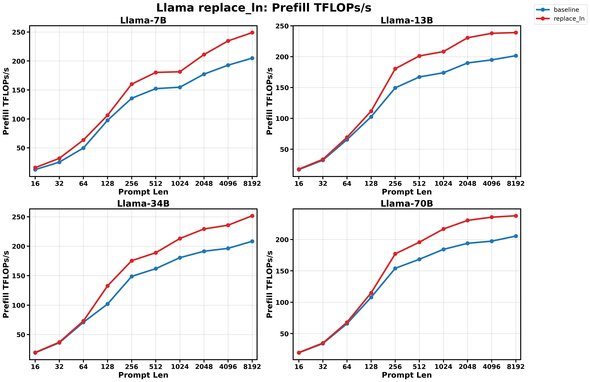
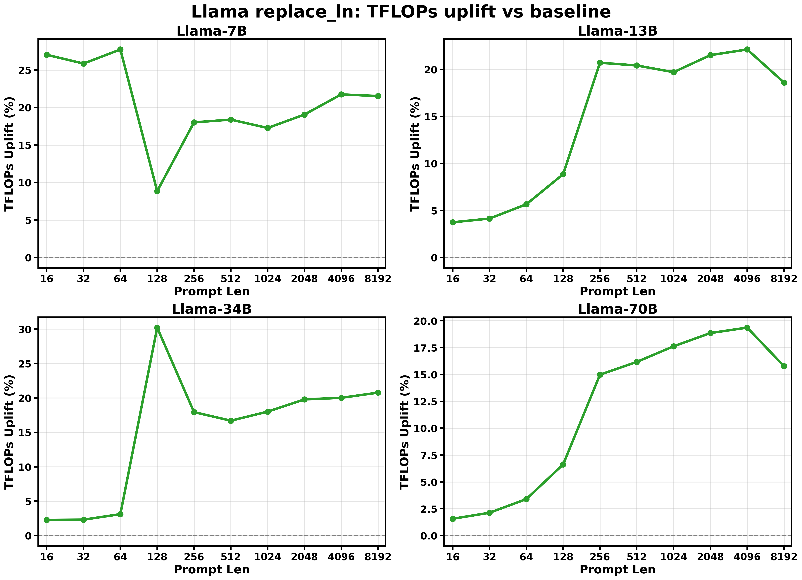
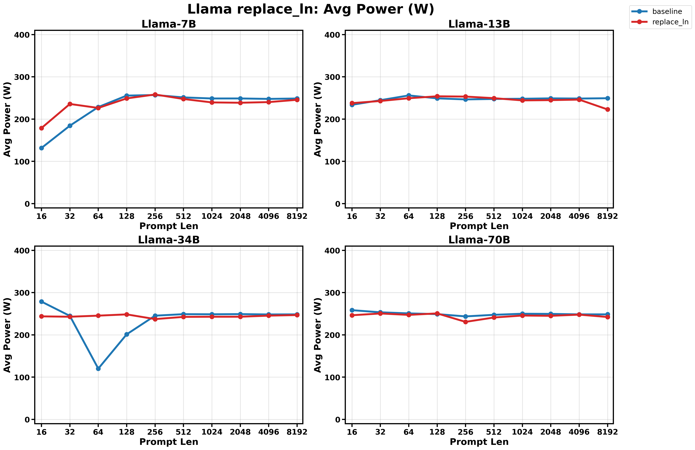
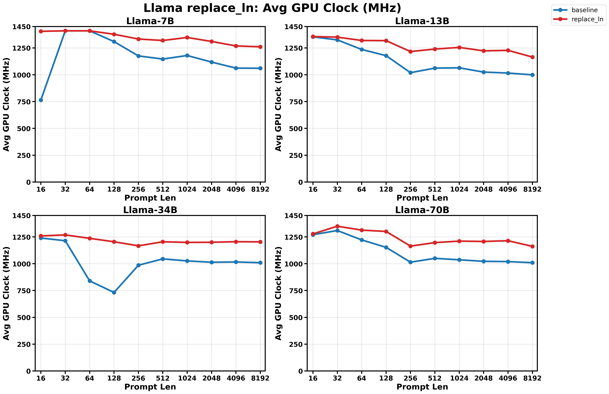

# Llama `replace_ln` Benchmark

Generated at `2026-04-24T10:04:29.708099Z`.

## Summary

- Standard matrix: `7B/13B/34B/70B` x `16/32/64/128/256/512/1024/2048/4096/8192` x `baseline/replace_ln`
- Result directory: `results/llama_replace_ln_prefill/latest/a100_40g_pcie`
- Summary CSV: `results/llama_replace_ln_prefill/latest/a100_40g_pcie/summary.csv`
- Metadata: `results/llama_replace_ln_prefill/latest/a100_40g_pcie/metadata.json`
- Plots directory: `results/llama_replace_ln_prefill/latest/a100_40g_pcie/plots`
- `--replace_ln` is an ablation flag, not a numerically equivalent model variant.
- Prompt lengths outside the standard matrix are excluded from the summary tables and plots in this report.
- Source run directory: `results/llama_replace_ln_prefill/20260424T095738Z`
- This directory is the git-tracked latest snapshot of that source run.

## Environment

- Python: `3.13.13`
- Torch: `2.11.0+cu130`
- CUDA available: `True`
- CUDA device: `NVIDIA A100-PCIE-40GB`
- Warmup / repeat / monitor interval: `5` / `10` / `0.01`

## Plots

### Prefill TFLOPs/s

### TFLOPs Uplift vs Baseline

### Avg Power

### Avg GPU Clock

## Successful Pairs

| Model | Prompt Len | baseline TFLOPs/s | replace_ln TFLOPs/s | delta TFLOPs/s | baseline TTFT (ms) | replace_ln TTFT (ms) | delta TTFT | baseline Avg Power (W) | replace_ln Avg Power (W) | delta Power | baseline Avg GPU Clock (MHz) | replace_ln Avg GPU Clock (MHz) | delta Clock |
| --- | ---: | ---: | ---: | ---: | ---: | ---: | ---: | ---: | ---: | ---: | ---: | ---: | ---: |
| 7B | 16 | 12.48 | 15.85 | +27.03% | 16.62 | 13.08 | -21.28% | 131.60 | 178.78 | +35.84% | 765.00 | 1405.38 | +83.71% |
| 7B | 32 | 25.35 | 31.91 | +25.86% | 16.37 | 13.00 | -20.55% | 184.37 | 235.76 | +27.88% | 1410.00 | 1410.00 | +0.00% |
| 7B | 64 | 49.80 | 63.62 | +27.74% | 16.69 | 13.06 | -21.71% | 228.45 | 226.33 | -0.93% | 1410.00 | 1410.00 | +0.00% |
| 7B | 128 | 97.59 | 106.23 | +8.85% | 17.08 | 15.69 | -8.13% | 255.57 | 248.93 | -2.60% | 1309.41 | 1378.12 | +5.25% |
| 7B | 256 | 135.62 | 160.06 | +18.02% | 24.70 | 20.93 | -15.27% | 256.91 | 258.19 | +0.50% | 1176.00 | 1333.57 | +13.40% |
| 7B | 512 | 152.27 | 180.26 | +18.39% | 44.45 | 37.55 | -15.53% | 251.28 | 247.52 | -1.50% | 1146.82 | 1320.00 | +15.10% |
| 7B | 1024 | 154.70 | 181.41 | +17.27% | 89.29 | 76.14 | -14.73% | 248.74 | 239.43 | -3.75% | 1179.89 | 1348.00 | +14.25% |
| 7B | 2048 | 177.30 | 211.10 | +19.06% | 162.01 | 136.07 | -16.01% | 248.80 | 238.66 | -4.08% | 1118.53 | 1310.82 | +17.19% |
| 7B | 4096 | 192.78 | 234.70 | +21.75% | 320.82 | 263.52 | -17.86% | 247.74 | 240.19 | -3.05% | 1062.19 | 1269.00 | +19.47% |
| 7B | 8192 | 204.91 | 249.03 | +21.53% | 689.50 | 567.36 | -17.71% | 248.71 | 245.63 | -1.24% | 1060.72 | 1261.10 | +18.89% |
| 13B | 16 | 16.98 | 17.61 | +3.74% | 23.93 | 23.06 | -3.61% | 233.79 | 237.72 | +1.68% | 1353.75 | 1356.52 | +0.20% |
| 13B | 32 | 32.28 | 33.61 | +4.14% | 25.19 | 24.18 | -3.98% | 244.72 | 242.82 | -0.78% | 1325.40 | 1351.25 | +1.95% |
| 13B | 64 | 65.59 | 69.30 | +5.66% | 24.81 | 23.48 | -5.36% | 255.95 | 249.32 | -2.59% | 1236.00 | 1320.00 | +6.80% |
| 13B | 128 | 102.67 | 111.76 | +8.86% | 31.77 | 29.18 | -8.14% | 249.05 | 253.90 | +1.95% | 1178.44 | 1318.45 | +11.88% |
| 13B | 256 | 149.52 | 180.49 | +20.71% | 43.80 | 36.29 | -17.16% | 246.52 | 253.22 | +2.72% | 1019.65 | 1216.67 | +19.32% |
| 13B | 512 | 167.14 | 201.26 | +20.42% | 79.02 | 65.62 | -16.96% | 247.63 | 249.46 | +0.74% | 1062.12 | 1239.92 | +16.74% |
| 13B | 1024 | 174.01 | 208.30 | +19.71% | 154.27 | 128.87 | -16.46% | 248.08 | 244.22 | -1.56% | 1065.00 | 1255.39 | +17.88% |
| 13B | 2048 | 189.87 | 230.73 | +21.52% | 291.80 | 240.13 | -17.71% | 249.02 | 244.87 | -1.67% | 1025.17 | 1223.20 | +19.32% |
| 13B | 4096 | 194.84 | 237.94 | +22.12% | 603.99 | 494.58 | -18.11% | 248.59 | 246.09 | -1.01% | 1016.12 | 1227.91 | +20.84% |
| 13B | 8192 | 201.60 | 239.10 | +18.60% | 1303.85 | 1099.32 | -15.69% | 249.33 | 222.78 | -10.65% | 999.24 | 1165.33 | +16.62% |
| 34B | 16 | 19.10 | 19.54 | +2.28% | 27.84 | 27.21 | -2.23% | 278.68 | 243.80 | -12.51% | 1239.64 | 1259.44 | +1.60% |
| 34B | 32 | 36.22 | 37.06 | +2.32% | 29.37 | 28.71 | -2.27% | 244.91 | 242.91 | -0.82% | 1214.48 | 1268.79 | +4.47% |
| 34B | 64 | 70.94 | 73.15 | +3.12% | 30.01 | 29.11 | -3.03% | 120.14 | 245.50 | +104.34% | 840.00 | 1236.72 | +47.23% |
| 34B | 128 | 101.89 | 132.67 | +30.21% | 41.86 | 32.15 | -23.20% | 201.30 | 248.48 | +23.44% | 731.79 | 1204.69 | +64.62% |
| 34B | 256 | 148.72 | 175.40 | +17.94% | 57.53 | 48.78 | -15.21% | 245.44 | 237.33 | -3.31% | 986.05 | 1166.88 | +18.34% |
| 34B | 512 | 161.91 | 188.94 | +16.69% | 106.32 | 91.11 | -14.31% | 248.99 | 242.57 | -2.58% | 1045.14 | 1204.67 | +15.26% |
| 34B | 1024 | 180.53 | 213.03 | +18.01% | 192.99 | 163.55 | -15.26% | 248.76 | 242.90 | -2.35% | 1026.11 | 1198.79 | +16.83% |
| 34B | 2048 | 191.41 | 229.27 | +19.78% | 372.67 | 311.12 | -16.52% | 249.14 | 242.95 | -2.48% | 1013.61 | 1200.05 | +18.39% |
| 34B | 4096 | 196.36 | 235.66 | +20.01% | 760.14 | 633.37 | -16.68% | 248.31 | 245.50 | -1.13% | 1016.31 | 1205.35 | +18.60% |
| 34B | 8192 | 208.38 | 251.66 | +20.77% | 1559.20 | 1291.08 | -17.20% | 248.50 | 246.91 | -0.64% | 1009.55 | 1203.87 | +19.25% |
| 70B | 16 | 19.46 | 19.77 | +1.57% | 28.14 | 27.71 | -1.55% | 258.45 | 246.42 | -4.65% | 1270.71 | 1278.21 | +0.59% |
| 70B | 32 | 34.21 | 34.94 | +2.13% | 32.03 | 31.36 | -2.08% | 253.40 | 250.63 | -1.09% | 1309.69 | 1350.00 | +3.08% |
| 70B | 64 | 65.87 | 68.11 | +3.40% | 33.30 | 32.20 | -3.29% | 250.82 | 247.30 | -1.40% | 1221.82 | 1313.44 | +7.50% |
| 70B | 128 | 107.82 | 114.96 | +6.63% | 40.73 | 38.20 | -6.21% | 249.12 | 250.81 | +0.68% | 1152.75 | 1301.05 | +12.87% |
| 70B | 256 | 154.03 | 177.11 | +14.98% | 57.16 | 49.71 | -13.03% | 243.72 | 230.75 | -5.32% | 1014.21 | 1164.18 | +14.79% |
| 70B | 512 | 168.45 | 195.69 | +16.17% | 105.05 | 90.43 | -13.92% | 247.47 | 241.12 | -2.57% | 1050.14 | 1196.97 | +13.98% |
| 70B | 1024 | 184.24 | 216.71 | +17.62% | 193.95 | 164.89 | -14.98% | 249.99 | 245.75 | -1.70% | 1036.49 | 1210.93 | +16.83% |
| 70B | 2048 | 193.89 | 230.44 | +18.86% | 375.70 | 316.10 | -15.86% | 249.62 | 245.09 | -1.82% | 1022.44 | 1207.62 | +18.11% |
| 70B | 4096 | 197.35 | 235.56 | +19.36% | 766.07 | 641.80 | -16.22% | 248.47 | 247.86 | -0.24% | 1019.74 | 1214.57 | +19.11% |
| 70B | 8192 | 205.39 | 237.78 | +15.77% | 1579.19 | 1364.11 | -13.62% | 248.54 | 242.30 | -2.51% | 1009.89 | 1161.74 | +15.04% |

## Failed Runs

No failed runs were recorded.
