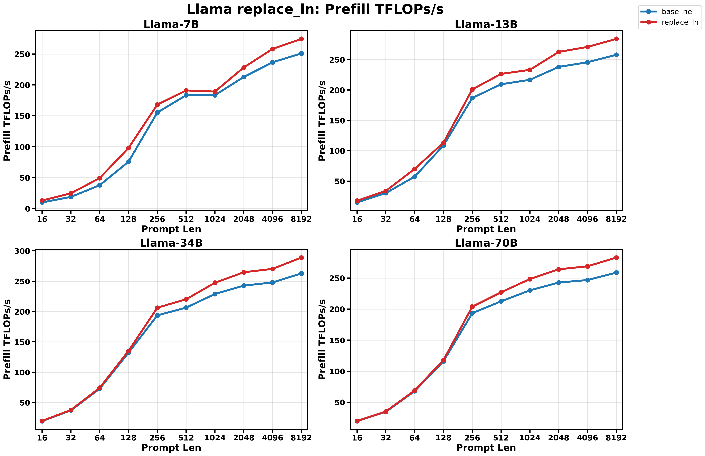
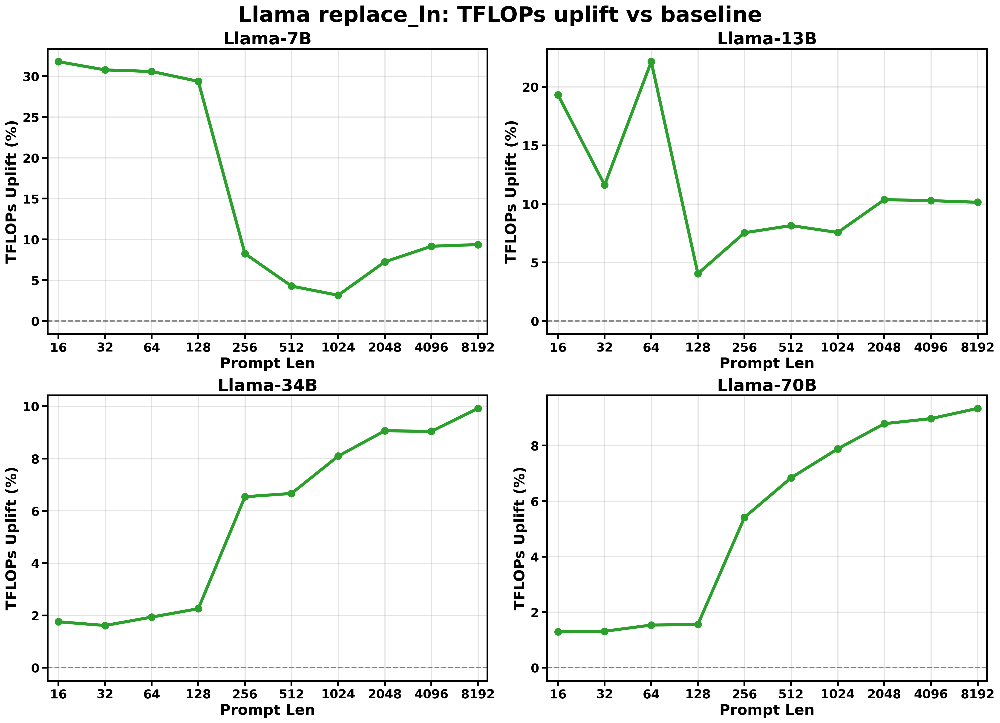
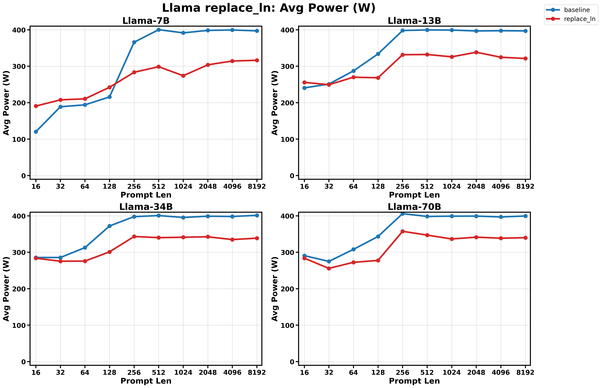
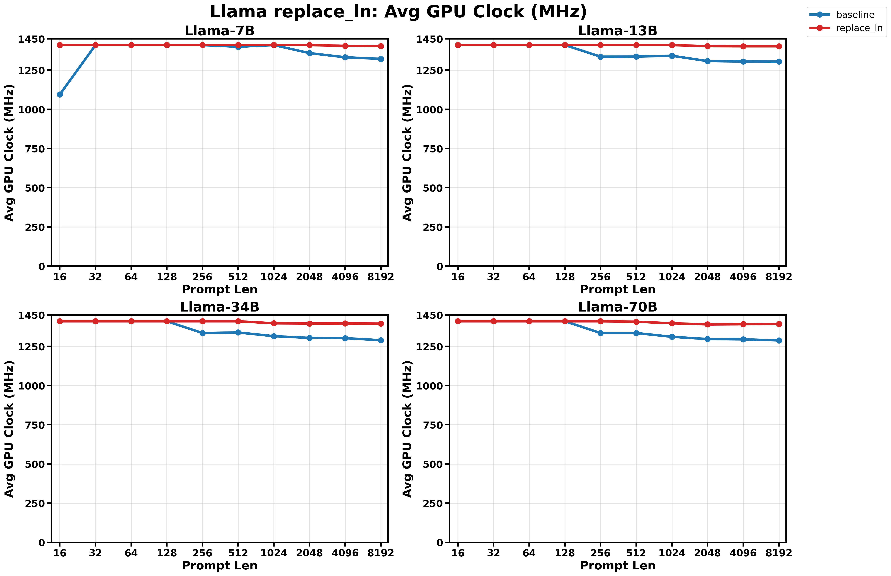

# Llama `replace_ln` Benchmark

Generated at `2026-04-24T10:03:54.249914Z`.

## Summary

- Standard matrix: `7B/13B/34B/70B` x `16/32/64/128/256/512/1024/2048/4096/8192` x `baseline/replace_ln`
- Result directory: `results/llama_replace_ln_prefill/latest/a100_40g_sxm`
- Summary CSV: `results/llama_replace_ln_prefill/latest/a100_40g_sxm/summary.csv`
- Metadata: `results/llama_replace_ln_prefill/latest/a100_40g_sxm/metadata.json`
- Plots directory: `results/llama_replace_ln_prefill/latest/a100_40g_sxm/plots`
- `--replace_ln` is an ablation flag, not a numerically equivalent model variant.
- Prompt lengths outside the standard matrix are excluded from the summary tables and plots in this report.
- Source run directory: `/home/cage/wattserve/results/llama_replace_ln_prefill/20260414T175515Z`
- This directory is the git-tracked latest snapshot of that source run.

## Environment

- Python: `3.13.2`
- Torch: `2.11.0+cu130`
- CUDA available: `True`
- CUDA device: `NVIDIA A100-SXM4-40GB`
- Warmup / repeat / monitor interval: `5` / `10` / `0.01`

## Plots

### Prefill TFLOPs/s

### TFLOPs Uplift vs Baseline

### Avg Power

### Avg GPU Clock

## Successful Pairs

| Model | Prompt Len | baseline TFLOPs/s | replace_ln TFLOPs/s | delta TFLOPs/s | baseline TTFT (ms) | replace_ln TTFT (ms) | delta TTFT | baseline Avg Power (W) | replace_ln Avg Power (W) | delta Power | baseline Avg GPU Clock (MHz) | replace_ln Avg GPU Clock (MHz) | delta Clock |
| --- | ---: | ---: | ---: | ---: | ---: | ---: | ---: | ---: | ---: | ---: | ---: | ---: | ---: |
| 7B | 16 | 9.78 | 12.89 | +31.78% | 21.20 | 16.08 | -24.12% | 120.39 | 190.69 | +58.39% | 1095.00 | 1410.00 | +28.77% |
| 7B | 32 | 18.76 | 24.54 | +30.77% | 22.12 | 16.91 | -23.53% | 188.83 | 207.77 | +10.03% | 1410.00 | 1410.00 | +0.00% |
| 7B | 64 | 37.70 | 49.22 | +30.58% | 22.05 | 16.88 | -23.42% | 194.06 | 210.59 | +8.52% | 1410.00 | 1410.00 | +0.00% |
| 7B | 128 | 75.69 | 97.92 | +29.37% | 22.02 | 17.02 | -22.70% | 215.84 | 242.31 | +12.26% | 1410.00 | 1410.00 | +0.00% |
| 7B | 256 | 155.39 | 168.21 | +8.25% | 21.56 | 19.92 | -7.62% | 365.89 | 283.42 | -22.54% | 1410.00 | 1410.00 | +0.00% |
| 7B | 512 | 183.26 | 191.10 | +4.27% | 36.94 | 35.42 | -4.10% | 400.28 | 298.75 | -25.37% | 1399.17 | 1410.00 | +0.77% |
| 7B | 1024 | 183.44 | 189.22 | +3.15% | 75.30 | 73.00 | -3.06% | 391.58 | 273.88 | -30.06% | 1410.00 | 1410.00 | +0.00% |
| 7B | 2048 | 212.84 | 228.27 | +7.25% | 134.96 | 125.84 | -6.76% | 398.34 | 303.84 | -23.72% | 1358.68 | 1410.00 | +3.78% |
| 7B | 4096 | 236.62 | 258.29 | +9.16% | 261.38 | 239.45 | -8.39% | 399.44 | 314.35 | -21.30% | 1332.20 | 1404.89 | +5.46% |
| 7B | 8192 | 250.99 | 274.49 | +9.37% | 562.93 | 514.72 | -8.56% | 397.07 | 316.34 | -20.33% | 1321.92 | 1402.77 | +6.12% |
| 13B | 16 | 14.87 | 17.74 | +19.31% | 27.32 | 22.90 | -16.18% | 240.59 | 255.72 | +6.29% | 1410.00 | 1410.00 | +0.00% |
| 13B | 32 | 30.30 | 33.83 | +11.62% | 26.82 | 24.03 | -10.41% | 251.11 | 249.35 | -0.70% | 1410.00 | 1410.00 | +0.00% |
| 13B | 64 | 57.34 | 70.04 | +22.15% | 28.38 | 23.23 | -18.13% | 287.30 | 269.89 | -6.06% | 1410.00 | 1410.00 | +0.00% |
| 13B | 128 | 108.74 | 113.14 | +4.04% | 29.99 | 28.83 | -3.89% | 333.77 | 268.33 | -19.61% | 1410.00 | 1410.00 | +0.00% |
| 13B | 256 | 186.80 | 200.88 | +7.54% | 35.06 | 32.61 | -7.01% | 398.05 | 331.59 | -16.70% | 1335.88 | 1410.00 | +5.55% |
| 13B | 512 | 209.29 | 226.35 | +8.15% | 63.10 | 58.35 | -7.54% | 399.67 | 332.21 | -16.88% | 1336.69 | 1410.00 | +5.48% |
| 13B | 1024 | 216.67 | 233.05 | +7.56% | 123.89 | 115.19 | -7.03% | 399.26 | 325.82 | -18.39% | 1341.89 | 1410.00 | +5.08% |
| 13B | 2048 | 237.87 | 262.53 | +10.37% | 232.92 | 211.04 | -9.39% | 396.82 | 338.38 | -14.73% | 1307.69 | 1402.86 | +7.28% |
| 13B | 4096 | 245.51 | 270.75 | +10.28% | 479.33 | 434.65 | -9.32% | 397.46 | 324.68 | -18.31% | 1305.32 | 1402.31 | +7.43% |
| 13B | 8192 | 257.81 | 283.96 | +10.14% | 1019.56 | 925.68 | -9.21% | 396.92 | 321.25 | -19.07% | 1304.85 | 1402.30 | +7.47% |
| 34B | 16 | 19.42 | 19.76 | +1.76% | 27.38 | 26.91 | -1.73% | 285.65 | 283.78 | -0.66% | 1410.00 | 1410.00 | +0.00% |
| 34B | 32 | 37.15 | 37.75 | +1.61% | 28.64 | 28.18 | -1.59% | 285.70 | 275.46 | -3.58% | 1410.00 | 1410.00 | +0.00% |
| 34B | 64 | 72.87 | 74.28 | +1.93% | 29.22 | 28.67 | -1.90% | 312.87 | 275.90 | -11.82% | 1410.00 | 1410.00 | +0.00% |
| 34B | 128 | 132.17 | 135.15 | +2.26% | 32.27 | 31.56 | -2.21% | 372.23 | 301.22 | -19.08% | 1410.00 | 1410.00 | +0.00% |
| 34B | 256 | 193.65 | 206.31 | +6.54% | 44.18 | 41.47 | -6.13% | 397.82 | 343.29 | -13.71% | 1335.00 | 1410.00 | +5.62% |
| 34B | 512 | 206.47 | 220.23 | +6.66% | 83.37 | 78.17 | -6.25% | 400.77 | 340.22 | -15.11% | 1338.66 | 1410.00 | +5.33% |
| 34B | 1024 | 228.90 | 247.42 | +8.09% | 152.21 | 140.82 | -7.48% | 395.64 | 341.22 | -13.76% | 1315.00 | 1397.27 | +6.26% |
| 34B | 2048 | 242.71 | 264.69 | +9.06% | 293.89 | 269.48 | -8.30% | 399.02 | 342.56 | -14.15% | 1303.96 | 1395.62 | +7.03% |
| 34B | 4096 | 247.89 | 270.30 | +9.04% | 602.11 | 552.20 | -8.29% | 398.34 | 334.89 | -15.93% | 1302.31 | 1396.27 | +7.21% |
| 34B | 8192 | 262.86 | 288.92 | +9.91% | 1236.04 | 1124.54 | -9.02% | 401.29 | 338.76 | -15.58% | 1289.15 | 1395.11 | +8.22% |
| 70B | 16 | 19.70 | 19.95 | +1.29% | 27.81 | 27.45 | -1.28% | 290.78 | 283.71 | -2.43% | 1410.00 | 1410.00 | +0.00% |
| 70B | 32 | 34.75 | 35.20 | +1.31% | 31.54 | 31.13 | -1.30% | 275.05 | 255.90 | -6.96% | 1410.00 | 1410.00 | +0.00% |
| 70B | 64 | 67.97 | 69.01 | +1.54% | 32.27 | 31.78 | -1.51% | 308.05 | 272.47 | -11.55% | 1410.00 | 1410.00 | +0.00% |
| 70B | 128 | 116.10 | 117.90 | +1.56% | 37.83 | 37.25 | -1.53% | 343.39 | 277.68 | -19.14% | 1410.00 | 1410.00 | +0.00% |
| 70B | 256 | 193.42 | 203.89 | +5.41% | 45.52 | 43.18 | -5.14% | 406.12 | 357.53 | -11.97% | 1335.00 | 1410.00 | +5.62% |
| 70B | 512 | 212.50 | 227.04 | +6.84% | 83.27 | 77.94 | -6.40% | 398.39 | 347.18 | -12.85% | 1335.00 | 1407.27 | +5.41% |
| 70B | 1024 | 230.16 | 248.30 | +7.88% | 155.26 | 143.92 | -7.31% | 399.11 | 336.59 | -15.66% | 1310.98 | 1397.22 | +6.58% |
| 70B | 2048 | 242.68 | 264.00 | +8.79% | 300.16 | 275.91 | -8.08% | 399.32 | 341.50 | -14.48% | 1296.58 | 1390.13 | +7.21% |
| 70B | 4096 | 246.72 | 268.85 | +8.97% | 612.77 | 562.33 | -8.23% | 397.07 | 338.68 | -14.71% | 1294.67 | 1391.15 | +7.45% |
| 70B | 8192 | 258.73 | 282.89 | +9.34% | 1253.64 | 1146.58 | -8.54% | 399.49 | 340.03 | -14.88% | 1288.28 | 1392.46 | +8.09% |

## Failed Runs

No failed runs were recorded.
